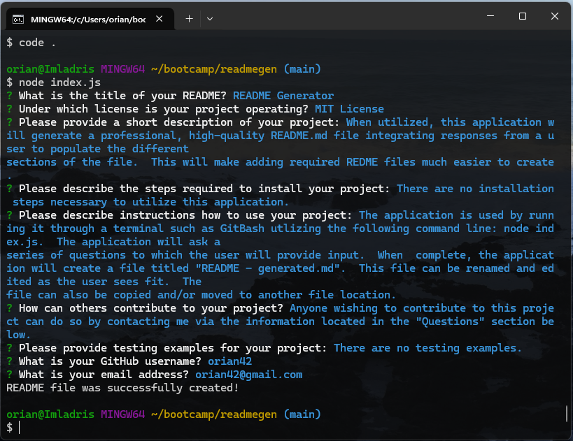

# README Generator
  

  

## Description
  

When utilized, this application will generate a professional, high-quality README.md file integrating responses from a user to populate the different sections of the file.  This will make adding required README files much easier to create.
  

## Table of Contents
  

- [Installation](#installation)
  
- [Usage](#usage)
  
- [License](#license)
  
- [Contributing](#contributing)
  
- [Tests](#tests)
  
- [Questions](#questions)
  

## Installation
  

There are no installation steps necessary to utilize this application.
  

## Usage
  

The application is used by running it through a terminal such as GitBash utlizing the following command line: node index.js.  The application will ask a series of questions to which the user will provide input.  When  complete, the application will create a file titled "README - generated.md".  This file can be renamed and edited as the user sees fit.  The file can also be copied and/or moved to another file location.

A video demonstration of this application can be viewed at https://app.screencastify.com/v2/manage/videos/pxDM0ShXVE0bXRDGfGhv.

The repository for this application can be viewed at https://github.com/orian42/readmegen.

## License
  

This application is operating under the following license: **MIT License**.  
  

Further information regarding this license, to include the required notice, can be read by navigating to the following link: https://opensource.org/licenses/MIT.
  

## Contributing
  

Anyone wishing to contribute to this project can do so by contacting me via the information located in the "Questions" section below.
  

## Tests
  

There are no testing examples.
  

## Questions
  

Any questions regarding this project can be answered by contacting me through my GitHub profile or by email:
  
GitHub Profile: https://github.com/orian42
  
email: orian42@gmail.com
